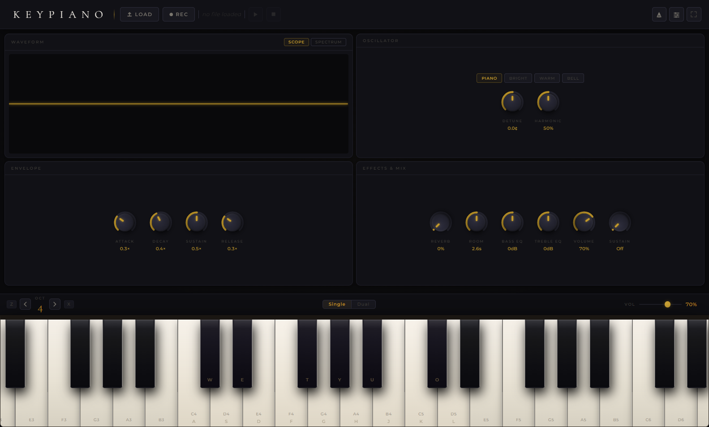

> **Experiment:** This repository is managed entirely by [Claude](https://claude.ai) (Anthropic's AI assistant). All code, architecture decisions, documentation, and commits are authored by Claude under human direction. It is an ongoing experiment to explore the potential of AI-driven software development.

---

# KeyPiano

A desktop piano that turns your laptop keyboard into a playable instrument. No hardware, no samples, no setup — just open and play.

Built with **Electron** and the **Web Audio API**. Audio is synthesised using a physically-modelled grand piano engine: zone-based harmonic profiles, detuned unison oscillators (string coupling), natural decay envelopes, and bandpass-filtered noise bursts for hammer strikes.



---

## Features

- **Laptop keyboard → piano keys** — play instantly with A–L and W/E/T/Y/U/O
- **Physical piano model** — four acoustic zones (bass / tenor / treble / hi-treble), detuned string oscillators, hammer noise burst
- **Three keyboard modes** — Standard, Strict Rows (9 consecutive white keys), and Pro (three rows cover three octaves simultaneously)
- **Sustain pedal** — vertical strip on the left; drag or press Space to toggle
- **Octave & semitone shifting** — `←`/`→` to shift octave; `↑`/`↓` for semitone fine-tune
- **Key zoom** — adjust how many octaves are visible in the piano viewport (1–7)
- **Dual dock** — split the piano into upper and lower keyboards, each with independent octave control
- **Oscillator presets** — piano, bright, mellow, organ, and more; adjustable harmonic brightness
- **Envelope controls** — per-note ADSR multipliers (attack, decay, sustain level, release)
- **Effects & mix** — detune scale, reverb-style sustain, volume
- **Waveform visualiser** — real-time oscilloscope or spectrum view
- **Metronome** — built-in click track with configurable BPM and time signature
- **MIDI + KPS file playback** — load any `.mid` or `.kps` file and play it back
- **WAV export** — export a playback session as a `.wav` audio file
- **Visual key highlighting** — on-screen keys light up during keyboard and playback input
- **Help popup** — `Ctrl+H` at any time shows the current keyboard layout with note names
- **Fullscreen** — F11 or the corner button

---

## Keyboard Layout

```
   W   E       T   Y   U       O
 A   S   D   F   G   H   J   K   L
```

| Key | Note | | Key | Note |
|-----|------|-|-----|------|
| `A` | C    | | `G` | G    |
| `W` | C♯   | | `Y` | G♯   |
| `S` | D    | | `H` | A    |
| `E` | E♭   | | `U` | B♭   |
| `D` | E    | | `J` | B    |
| `F` | F    | | `K` | C+1  |
| `T` | F♯   | | `O` | C♯+1 |
|     |      | | `L` | D+1  |

### Transport controls

| Key / Control | Action |
|---|---|
| `←` / `→` | Octave down / up (resets semitone shift) |
| `↑` / `↓` | Semitone fine-tune +1 / −1 |
| `Space` | Toggle sustain pedal |
| `Ctrl+H` | Show / hide keyboard layout popup |
| `F11` | Toggle fullscreen |

### Keyboard modes

| Mode | How to activate | What changes |
|---|---|---|
| **Standard** | Default | A–L plays one octave; W/E/T/Y/U/O are black keys |
| **Strict Rows** | Toggle in toolbar | A–L plays 9 consecutive white keys; W–O plays their black keys |
| **Pro** | Toggle in toolbar | Q-row = Oct−1, A-row = Oct, Z-row = Oct+1; hold Shift for black keys |

---

## Getting Started

### Prerequisites

- [Node.js](https://nodejs.org/) v18+
- npm

### Install & Run

```bash
git clone <repo-url>
cd piano-app
npm install
npm start
```

### Loading Score Files

Place `.kps` or `.mid` files in the `scores/` folder (gitignored). Click **Load ♩** in the transport bar to open a file, then **▶** to play.

---

## Project Structure

```
piano-app/
├── src/
│   ├── constants.js           Layout constants and keyboard maps
│   ├── state.js               Shared mutable application state
│   ├── audio/
│   │   ├── context.js         AudioContext singleton + gain buses
│   │   ├── metronome.js       Metronome click-track engine
│   │   ├── piano-model.js     Zone definitions, oscillator synthesis
│   │   └── playback.js        Pre-scheduled KPS/MIDI playback engine
│   ├── parsers/
│   │   ├── midi.js            Standard MIDI File binary parser
│   │   └── kps.js             KeyPiano Score JSON parser
│   ├── ui/
│   │   ├── interactions.js    pressNote / releaseNote
│   │   ├── piano-builder.js   Piano DOM construction
│   │   ├── sustain-strip.js   Sustain strip drag interaction
│   │   └── viewport.js        Octave highlights, labels, scroll, zoom
│   ├── renderer.js            Entry point — wires all modules together
│   ├── main.cjs               Electron main process
│   └── index.html             App shell
├── scores/                    Score files (.kps, .mid) — gitignored
├── docs/                      Project specifications — gitignored
├── test/
│   └── unit.test.js           Node built-in test runner unit tests
├── smoke-test.js              Playwright end-to-end smoke test + screenshot
├── .eslintrc.json
├── .prettierrc
├── package.json
└── README.md
```

---

## KPS Format

KeyPiano Score is a simple JSON format for compositions:

```json
{
  "title": "Example",
  "composer": "Author",
  "tempo": 120,
  "notes": [
    { "note": "C4",  "time": 0.0, "duration": 1.0 },
    { "note": "E♭4", "time": 1.0, "duration": 0.5 },
    { "note": "G4",  "time": 1.5, "duration": 0.5 }
  ]
}
```

- `time` and `duration` are in **quarter-note beats**, not seconds
- `note` is name + octave: `C4`, `F♯3`, `B♭4`, `G♯2`
- Simultaneous notes are natural — give them the same `time`

---

## Development

```bash
npm run lint                              # ESLint check
npm run lint:fix                          # auto-fix
npm run format                            # Prettier
npm test                                  # unit tests
node --input-type=commonjs < smoke-test.js  # end-to-end smoke test + screenshot
```

Architecture notes are in `CLAUDE.md`.

---

## Roadmap

- BPM override field in transport bar
- Note velocity (MIDI files embed per-note dynamics)
- Piano roll visualiser
- Recording to KPS

---

## License

MIT
